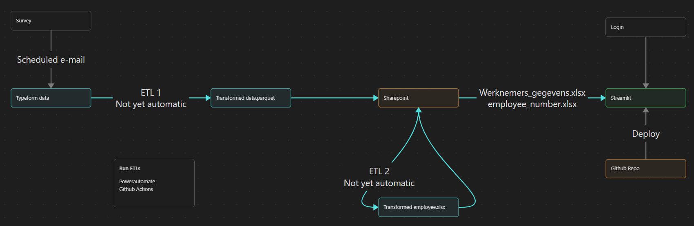

# Parquet to xlsx pipeline and dashboard deployment

Automated pipeline to fetch parquet files (transformed typeform data) and transform them to .xlsx files usable by a Streamlit dashboard.

## Overview

This project extends the existing performance data workflow by introducing a second ETL process (ETL2). Survey data collected through Typeform is first transformed into parquet files (ETL1). This project then:

1. Retrieves the parquet files from SharePoint  
2. Transforms them into structured Excel datasets  
3. Serves the data to a secured Streamlit dashboard  

The dashboard enables employees to reflect on their performance using aggregated peer and client feedback while ensuring controlled data access.

Key objectives:

- Fully automated data flow from SharePoint → ETL → Dashboard  
- Secure, authenticated access to sensitive performance data  
- Near real-time insights for internal use  



## Features
- Automated ETL pipeline (parquet → xlsx)
- SharePoint integration via Microsoft Graph / API
- Secure dashboard deployment on Streamlit Cloud
- Data anonymization for aggregated insights
- Personal authentication and scoped data visibility
- Modular project structure for maintainability

## Project Structure
```
project-root/
│
├── src/
│   └── performance_dashboard/
│       ├── dashboards/
│       │   └── app.py                # Dashboard entrypoint
│       │
│       ├── services/
│       │   ├── process_data.py      # ETL 2
│       │   └── sharepoint_client.py # SharePoint integration
│       │
│       ├── data/
│       │   ├── raw/                 # Untransformed data from ETL 1
│       │   │   ├── Opdrachtgever_Feedback/
│       │   │   └── Peer_feedback/
│       │   │
│       │   └── processed/           # Transformed data
│       │       └── Werknemers_gegevens - Test.xlsx
│       │
│       ├── config/                # Configuration (settings, etc.)
│       └── utils.py               # General helpers
│
├── notebooks/                     # Exploration
│   └── sharepoint_client.ipynb
│
├── tests/                         # Unit tests
│   └── test_app.py
│
├── pyproject.toml                 # Dependencies + build config
├── uv.lock                        # Locked dependency versions
├── runtime.txt                    # Runtime specification
└── README.md
```


# Usage

## Deploy dashboard locally
``` 
uv run streamlit run app.py
```

## Daily automation
The intended production setup runs ETL1 and ETL2 on a daily schedule.

Typical orchestration options:
GitHub Actions
Azure Functions / WebJobs
Cron-based VM job

## Dummy access
Dummy credentials can be used to explore the demo dashboard on https://performance-db.streamlit.app/:
```makefile
E-mail = test_email@email.com  
Password = L02RAWEL
```

## Installation

Clone the repository:

```bash
git clone <repo-url>
cd <repo-name>
```

Install dependencies:
```bash
uv sync
```

## Configuration
Create a .env file in the root folder, never commit!
```
TENANT_ID=
CLIENT_ID=
CLIENT_SECRET=
SHAREPOINT_SITE=
```
